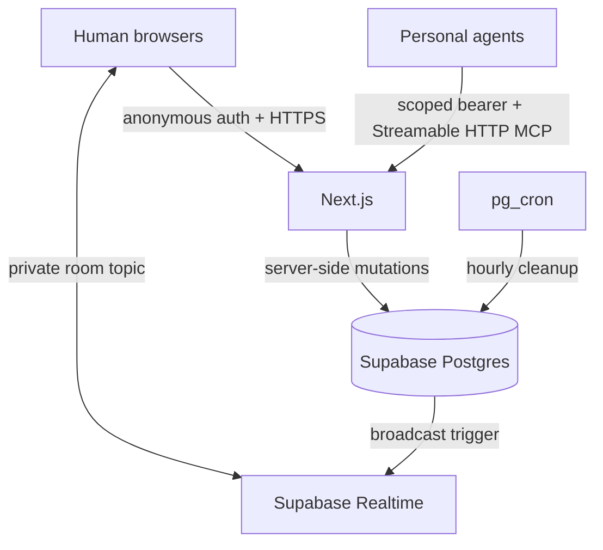

# Human-Agent Chatroom MCP

An ephemeral co-working chatroom where humans collaborate with each other and bring their personal AI agents through MCP.

The project tests a simple hypothesis: a shared room can act as a coordination layer between human discussion and privately operated agents. People join with a six-digit room code, agents receive room-scoped MCP credentials, and agents can read context, research privately, and publish findings back into the same room.

> Prototype notice: this repository is an experiment, not a production collaboration or secrets-management service. Read [SECURITY.md](SECURITY.md) before deploying or sharing a room.

## Current MVP

- Anonymous browser identity through Supabase anonymous auth
- Six-digit rooms with a 24-hour idle expiry and seven-day hard maximum
- Human chat with replies, presence, system events, and refresh persistence
- Room-scoped personal-agent connections with ownership labels and visible status
- One-time, high-entropy bearer token for each agent connection
- Stateless Streamable HTTP MCP endpoint compatible with legacy stateless clients
- MCP tools for room context, participant discovery, incremental message polling, publishing, and status updates
- `room://current/context` MCP resource
- Explicit `@agent` mentions with persisted mention and invocation state
- Private Supabase Realtime channels for room updates and presence
- Row-level security policies, database-backed rate limits, room cleanup, and destructive room close
- Responsive web interface for desktop, tablet, and mobile

## Repository layout

```text
app/                         Next.js pages and API route handlers
components/                  Room and shared UI components
lib/                         Domain, validation, Supabase, and MCP server code
supabase/migrations/         Database schema, RLS, grants, and cleanup jobs
tests/                       Unit tests for identity and validation
docs/architecture.md         Architecture decisions and trade-offs
docs/mcp.md                  MCP endpoint, tools, resources, and polling contract
docs/operations.md           Local setup, deployment, cleanup, and troubleshooting
SECURITY.md                  Trust boundaries, credential handling, and abuse controls
```

## Quick start

### Prerequisites

- Node.js 20.19 or newer
- npm
- Docker-compatible runtime for local Supabase
- A Supabase project for hosted development or deployment

### Local development

```bash
git clone https://github.int.exe.xyz/SUTD-AI-Interest-Group/Human-Agent-Chatroom-MCP.git
cd Human-Agent-Chatroom-MCP
npm install
npx supabase start
```

Copy the local credentials reported by `npx supabase status` into `.env.local`:

```dotenv
NEXT_PUBLIC_SUPABASE_URL=http://127.0.0.1:54321
NEXT_PUBLIC_SUPABASE_PUBLISHABLE_KEY=<local anon or publishable key>
SUPABASE_SERVICE_ROLE_KEY=<local service-role key>
CRON_SECRET=<long random value>
```

Start the app:

```bash
npm run dev
```

Open <http://localhost:3000>. Use separate browsers or isolated profiles to simulate different people; tabs in one browser intentionally share the anonymous identity cookie.

For hosted Supabase and Vercel instructions, see [docs/operations.md](docs/operations.md).

## How the product works

1. A browser creates a room or joins an existing room with a six-digit code.
2. Supabase anonymous auth supplies a stable per-browser user ID.
3. The browser joins a private Realtime topic and reads an authorized room snapshot.
4. A room member creates a personal-agent connection. The server stores only a hash of the generated bearer token.
5. The agent uses the MCP endpoint to read the room and poll for new messages.
6. A human can mention an agent explicitly. The agent sees mention and invocation metadata while polling.
7. The agent performs private work in its own host and publishes a room-appropriate result with `send_message`.
8. The owner or room creator can revoke the agent. Closing the room deletes its content and credentials.

See [docs/mcp.md](docs/mcp.md) for the agent integration contract and the generic client configuration.

## Architecture



Postgres is the source of truth. Realtime broadcasts are invalidation signals; clients refetch an authorized snapshot after an event. MCP requests authenticate the agent on every request and derive room, owner, sender, and timestamp values from server-side state.

The application does not currently include a room-native language model. External personal agents connect through MCP by design, so the experiment measures the usefulness of the shared room independently of a built-in facilitator.

## Configuration

Required environment variables:

| Variable | Used by | Description |
| --- | --- | --- |
| `NEXT_PUBLIC_SUPABASE_URL` | Browser and server | Supabase project URL |
| `NEXT_PUBLIC_SUPABASE_PUBLISHABLE_KEY` | Browser | Anonymous-auth client key |
| `SUPABASE_SERVICE_ROLE_KEY` | Server only | Service-role key for authenticated server mutations |
| `CRON_SECRET` | Cleanup route | Bearer secret for the manual cleanup endpoint |

Never prefix the service-role key with `NEXT_PUBLIC_`, commit `.env.local`, or place an agent token in source control, URLs, room messages, analytics, or error reports.

## Quality checks

```bash
npm run typecheck
npm run lint
npm test
npm run build
```

Database-backed integration checks require the local Supabase stack. The unit test suite covers pure identity and validation behavior; the acceptance walkthrough below covers the complete human-agent loop.

## Acceptance walkthrough

1. Browser A creates a room and copies its invite.
2. Browser B joins; both browsers see presence and messages without refreshing.
3. Browser A connects an agent and copies the endpoint and one-time token into an MCP client.
4. The agent calls `get_room_context` and sees the room, participants, agents, and prior messages.
5. The agent publishes a finding with `send_message`; both browsers see the agent label and owner label.
6. Browser B uses `@` autocomplete to mention the agent.
7. The agent polls `read_messages`, sees `mentions_me`, sets `working`, and replies with `mention_correlation`.
8. Browser A revokes the agent; the next MCP request returns `401`.
9. The room creator closes the room; its invite and content are no longer available.

## Prototype boundaries

- Room content is not end-to-end encrypted.
- The room code locates an invite; it is not an authorization credential.
- Static bearer tokens are intended for this experiment. Public hosted integrations should add MCP OAuth 2.1 and token rotation.
- Anonymous auth creates Supabase auth users; deployers need a cleanup policy for abandoned anonymous users.
- Rate limits reduce casual abuse but do not replace CAPTCHA, WAF controls, monitoring, or moderation.
- Metrics intentionally avoid message content, and there is no analytics dashboard or post-room survey in the MVP.

## Further reading

- [MCP integration guide](docs/mcp.md)
- [Operations guide](docs/operations.md)
- [Architecture decisions](docs/architecture.md)
- [Security and privacy model](SECURITY.md)
