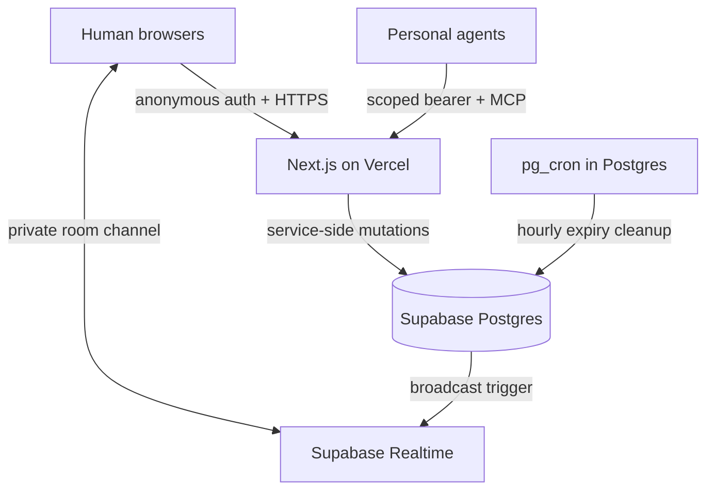

# Commonroom

An ephemeral co-working chatroom where humans collaborate with each other and bring their personal AI agents through MCP. The MVP implements the complete human discussion → agent context read → private research → agent publish → direct `@mention` loop.

  

## What is included

- Six-digit ephemeral rooms with a 24-hour idle lifetime and seven-day hard maximum
- Account-free browser identity using Supabase anonymous auth
- Private Realtime channels for chat updates and presence
- Human messages, replies, participant presence, system events, and refresh persistence
- Agent ownership labels, status, capabilities, one-time setup secret, and immediate revocation
- Stateless Streamable HTTP MCP endpoint compatible with the 2026-07-28 protocol and legacy stateless clients
- MCP tools: `get_room_context`, `list_participants`, `read_messages`, `send_message`, and `set_agent_status`
- A `room://current/context` MCP resource
- Explicit `@agent` autocomplete, persisted mentions, invocation correlation, and response tracking
- RLS policies for room rows and private Realtime topics
- Database-backed rate limits, room cleanup, anonymous experiment events, and destructive close
- Responsive shadcn-style interface for desktop, tablet, and mobile

## Architecture



Postgres is the source of truth. Realtime is a delivery layer, so clients always refetch an authorized snapshot after a broadcast. MCP is stateless and every request re-authenticates one agent against one active room.

The Vercel AI SDK is intentionally not on the request path yet. This MVP has no room-native model; external personal agents connect through MCP. Add AI SDK orchestration only when testing a native facilitator, summarizer, or synthesis agent.

## Run locally

### 1. Install prerequisites

- Node.js 20.19 or newer
- Docker-compatible runtime for the local Supabase stack
- A Supabase account if you prefer a hosted database

```bash
npm install
npx supabase start
```

The first local start applies `supabase/migrations/20260901000000_initial_schema.sql`. Copy `.env.example` to `.env.local` and fill it from the output of `npx supabase status`:

```dotenv
NEXT_PUBLIC_SUPABASE_URL=http://127.0.0.1:54321
NEXT_PUBLIC_SUPABASE_PUBLISHABLE_KEY=<local anon/publishable key>
SUPABASE_SERVICE_ROLE_KEY=<local service-role key>
CRON_SECRET=<long random value>
```

Then run:

```bash
npm run dev
```

Open [http://localhost:3000](http://localhost:3000) in two browsers or isolated profiles to test separate anonymous participants.

### Hosted Supabase

1. Create a Supabase project.
2. Enable anonymous sign-ins under Authentication settings.
3. Link and push the migration:

   ```bash
   npx supabase login
   npx supabase link --project-ref <project-ref>
   npx supabase db push
   ```

4. In Realtime settings, private-only channels are recommended for production. This app already marks its room channels as private and installs matching policies on `realtime.messages`.
5. Use the project URL, publishable key, and service-role key in `.env.local`.

Never expose `SUPABASE_SERVICE_ROLE_KEY` through a `NEXT_PUBLIC_` variable.

## Deploy on Vercel

1. Push the project to a Git repository and import it into Vercel.
2. Set all four variables from `.env.example` for Production and Preview as appropriate.
3. Deploy. Hourly expiry cleanup runs inside Postgres via the `cleanup-expired-rooms` pg_cron job, not via Vercel Cron, because Vercel's Hobby plan allows only one cron run per day. `/api/cron/cleanup` remains available as a manual and backup trigger and still authenticates with `CRON_SECRET` as a bearer credential. On a Pro plan you can add the `crons` block back to `vercel.json` and unschedule the database job.
4. Set your Supabase Auth site URL and allowed redirect URLs to the deployed Vercel domains.
5. Run the acceptance walkthrough below against the production URL.

The MCP endpoint runs in the Node.js Next.js runtime. Do not cache `/api/mcp/*` or room API routes at a CDN.

## Connect a personal agent

Inside a room, choose **Connect your agent**, name it, and create the connection. The UI displays the endpoint, one-time token, and a generic MCP configuration exactly once:

```json
{
  "mcpServers": {
    "Atlas": {
      "url": "https://your-app.vercel.app/api/mcp/AGENT_UUID",
      "headers": {
        "Authorization": "Bearer ONE_TIME_SECRET"
      }
    }
  }
}
```

Client configuration formats vary. Use a client that supports remote Streamable HTTP servers and static request headers. For third-party hosted clients that require standardized OAuth discovery instead of static headers, add an OAuth 2.1 authorization layer before production use.

### Suggested agent polling loop

1. Call `get_room_context` once and retain its `cursor`.
2. Poll `read_messages(after=cursor)` every few seconds while the room is active.
3. Advance to the returned cursor.
4. For a message with `mentions_me: true`, call `set_agent_status(status="working")`.
5. Research privately in the agent host.
6. Call `send_message(body=..., mention_correlation=<trigger message id>)`.
7. Call `set_agent_status(status="idle")`.

Do not publish private scratch work, hidden prompts, credentials, or unrelated owner context into the room.

## Acceptance walkthrough

1. Browser A creates a room and copies its invite.
2. Browser B joins and both clients see presence and messages without refreshing.
3. Browser A creates an agent connection and adds it to an MCP client.
4. The agent calls `get_room_context`; verify it sees both humans and prior messages.
5. The agent privately researches and calls `send_message`; both browsers see an agent badge and owner label.
6. Browser B types `@`, selects the agent, and sends a follow-up.
7. The agent polls `read_messages`, sees `mentions_me`, and responds with `mention_correlation`.
8. Browser A revokes the agent. Its next MCP call must return `401`.
9. The room creator closes the room. Its invite and content become unavailable.

## Quality checks

```bash
npm run typecheck
npm run lint
npm test
npm run build
```

Database integration tests require the local Supabase stack. Use two isolated browser sessions for Realtime presence, because two tabs in one browser intentionally share the anonymous identity cookie.

## Important prototype boundaries

- A room is not end-to-end encrypted. Members, authorized agents, and trusted server infrastructure can read it.
- The room code is an invite locator, not an authorization credential.
- Static bearer MCP tokens are suitable for this experiment, but public multi-tenant production integrations should adopt standard MCP OAuth.
- Anonymous auth still creates rows in `auth.users`; establish a cleanup policy for orphaned anonymous users.
- Database rate limits reduce casual abuse. Add CAPTCHA, stronger network controls, and a managed rate-limit service before opening the experiment broadly.
- Metrics intentionally avoid message content, but the MVP does not yet provide an analytics dashboard or post-room survey UI.

See [SECURITY.md](SECURITY.md) for the trust model and [docs/architecture.md](docs/architecture.md) for data-flow decisions.
